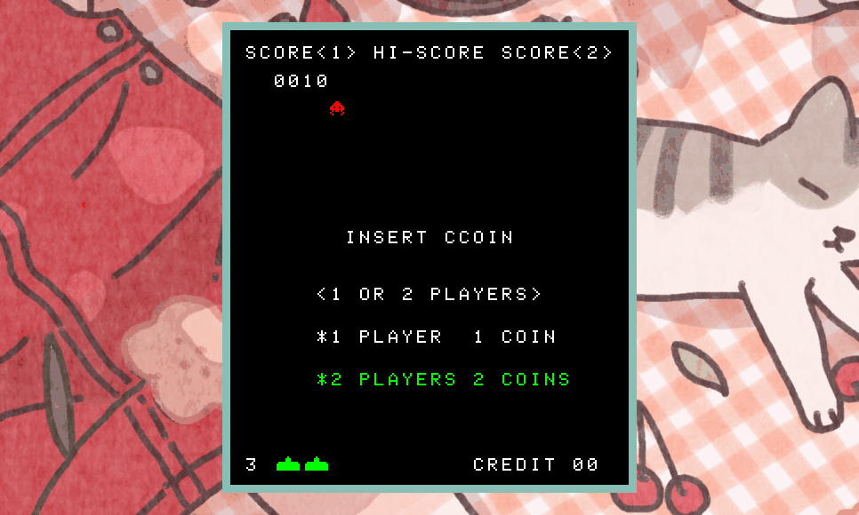

# i8080e



A simple emulator for the Intel 8080, along with other parts of the Space Invaders arcade system. Tested with the CPUDIAG routine, and Space Invaders.

## Building and running

### Supported systems

Tested with:

- x86_64 Linux Ubuntu 21.04 (gcc & glibc)
- armhf Raspberry Pi OS Buster (gcc & glibc)

Anything with a C compiler and SDL backend will probably work fine.

### Dependencies

- LibSDL 2

To install on Ubuntu: `$ sudo apt install libsdl2-dev libsdl2-image-dev libsdl2-mixer-dev libsdl2-ttf-dev`.

### Building

Run `$ make release` in the project directory to build, it puts the executable at `bin/i8080e`

### Getting the ROM

I can't distribute the ROM here for obvious copyright reasons, but it's not particularly hard to find.

Once you have it, extract it to `<project_directory>/rom`. The directory should look something like this:

```
i8080e/rom
├── invaders.e
├── invaders.f
├── invaders.g
└── invaders.h
```

### Running

Simply execute the binary from the project directory to run.

`$ bin/i8080e`

no arguments or flags are needed and it'll pick up and load the ROM from its directory.

## Keybinds

| Key | Action                |
| --- | --------------------- |
| c   | Insert coin           |
| 1   | Start 1-player game   |
| 2   | Start 2-player game   |
| ←   | Move left (player 1)  |
| →   | Move right (player 1) |
| ↑   | Shoot (player 1)      |
| a   | Move left (player 2)  |
| d   | Move right (player 2) |
| w   | Shoot (player 2)      |
